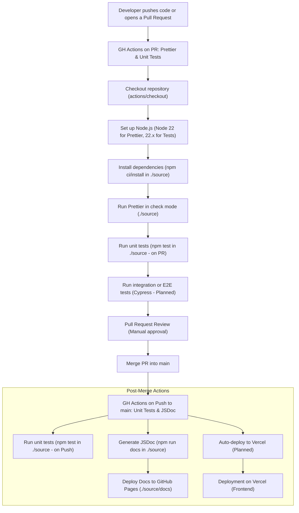

# CI/CD Pipeline Overview

## Current Functional CI/CD Stages

This section outlines the stages of our CI/CD pipeline, separated into workflows triggered by Pull Requests and workflows triggered by pushes to the `main` branch (typically post-merge).

### Workflow on Pull Request to `main`

These steps are executed when a developer opens a Pull Request against the `main` branch.

### 1. Developer pushes code or opens a Pull Request

- **Status:** Fully Functional
- **Details:** Development is done through feature branches. Once a developer opens a PR against the `main` branch, it triggers the PR-specific pipeline workflows.

### 2. GitHub Actions triggered on PR to `main` branch

- **Status:** Fully Functional
- **Details:** The GitHub Actions workflows (`format-check.yml`, `unit-tests.yml`) are set to run on `pull_request` events targeting `main`. This initiates automated checks and tests.

### 3. Checkout repository (`actions/checkout`)

- **Status:** Fully Functional
- **Details:** Uses `actions/checkout@v3` (in `format-check.yml`) and `actions/checkout@v4` (in `unit-tests.yml` and `gen-docs.yml`) to fetch the latest code in the PR or branch.

### 4. Set up Node.js environment (`actions/setup-node`)

- **Status:** Fully Functional
- **Details:**
  - **Prettier Workflow (`format-check.yml`):** Node.js version `22` is installed using `actions/setup-node@v3`.
  - **Unit Tests Workflow (`unit-tests.yml`):** Node.js version `22.x` is installed using `actions/setup-node@v4`.
  - This ensures consistent runtime behavior for different pipeline jobs.

### 5. Install dependencies

- **Status:** Fully Functional
- **Details:** Dependencies are installed within the `./source` working directory:
  - **Prettier Workflow (`format-check.yml`):** Uses `npm ci` for a clean install of dependencies.
  - **Unit Tests Workflow (`unit-tests.yml`):** Uses `npm install` to get necessary packages for testing.

### 6. Run Prettier in check mode (`npx prettier . --check`)

- **Status:** Fully Functional
- **Details:** This step, part of `format-check.yml`, enforces consistent code style using `npx prettier . --check` within the `./source` directory. The build fails if any file is not formatted correctly, helping standardize codebase quality.

### 7. Run unit tests (`npm test`)

- **Status:** Fully Functional (Previously Planned)
- **Details:** Executes unit tests using `npm test` within the `./source` directory, as defined in `unit-tests.yml`. This workflow runs on Node.js `22.x`. Failure in tests will block the PR. This primarily covers frontend Jest tests.

### 8. Run integration or end-to-end tests (Maybe use Cypress)

- **Status:** Planned
- **Planned Setup:**
  - **Frontend:** Jest is configured for UI components and logic (covered by `npm test`).
  - **Backend:** Mocha/Chai could be used if specific backend API testing is separated (currently not implemented in CI).
- **Next Steps:** Add Cypress configuration for UI interaction tests, such as user profile flows and card creation validation.

### 9. Require Pull Request approval (Code Quality via Human Review)

- **Status:** Fully Functional
- **Details:** GitHub branch protection rules require at least one review before merging. This step ensures logical, stylistic, and documentation correctness.

### Workflow on Push to `main` (Post-Merge)

These steps are executed automatically after a Pull Request is merged into the `main` branch.

### 10. Merge PR into `main`

- **Status:** Functional (Manual Step)
- **Details:** Merges are performed manually after all CI checks (Prettier, unit tests) and human reviews are satisfied.

### 11. GitHub Actions triggered on Push to `main` branch

- **Status:** Fully Functional
- **Details:** Specific GitHub Actions workflows (`unit-tests.yml`, `gen-docs.yml`) are set to run on `push` events to the `main` branch.

### 12. Run unit tests (on push to `main`)

- **Status:** Fully Functional
- **Details:** The `unit-tests.yml` workflow re-runs unit tests using `npm test` (in `./source` on Node.js `22.x`) on every push to `main` to ensure the integrity of the main branch after merges.

### 13. Generate and Deploy JSDoc Documentation

- **Status:** Fully Functional
- **Details:** Triggered by `gen-docs.yml` on `push` to `main`:
  - Checks out code using `actions/checkout@v4`.
  - Sets up Node.js `22.x` using `actions/setup-node@v4`.
  - Installs dependencies with `npm install` in the `./source` directory.
  - Generates JSDoc documentation using `npm run docs` (output to `./source/docs`).
  - Deploys the generated documentation from `./source/docs` to GitHub Pages using `peaceiris/actions-gh-pages@v4`.

### 14. Auto-deploy `main` to staging or production

- **Status:** Planned
- **Details:** Once merged, Vercel will be configured to automatically deploy the latest code from `main`.

### 15. Deployment target: Vercel

- **Why Vercel:**
  - Minimal configuration
  - Fast deployments
  - Built-in CI integration
  - Serverless support for future API routes

---

## CI/CD Pipeline Diagram

---

## Summary

We’ve completed most of the initial CI steps including code formatting checks (Prettier), automated unit testing (Jest via `npm test`), enforcement of pull request reviews, and code checkout. We have also successfully implemented automated JSDoc generation and deployment to GitHub Pages.

Our next major milestones involve:

1. Setting up integration or end-to-end (E2E) tests, potentially using Cypress.
2. Configuring Vercel for automatic deployment of the `main` branch to a staging or production environment.

Once these are completed, our CI/CD pipeline will robustly enforce code quality and best practices, while enabling rapid development cycles and safe, automated releases.
