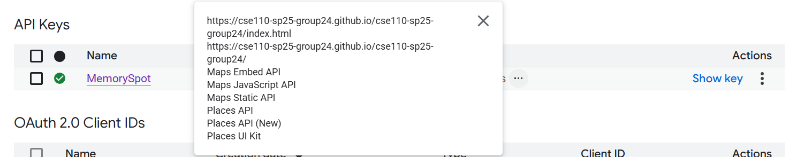
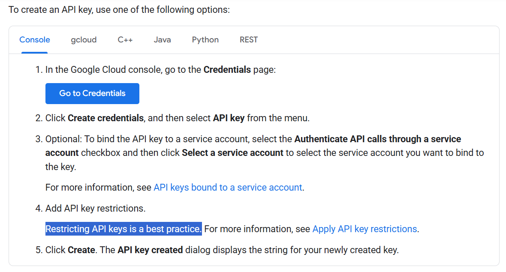

## Summary

_Currently, it is required to generate an API key for users to access the website. This is not idea and is a consequence from our lack of server-side interaction. I propose that the current system be a fallback and we used a restricted API key._

---

## Context and Problem Statement

This project hosts a static site on GitHub pages. This is within the scope of the constraints given. Because we are using an external service that has API keys, a consequence of not having a hosted backend server is that we have no way to actually hide the API key from the user. Our initial solution was to have the users get their own API key, but this is clunky and not a very rigorous way to approach this problem. Instead, we want to have the map load for all users using our site while also preventing bad actors from taking our API key and abusing it.

## Considered Options

### Option 1: The Original

- Users generate their own API key and then we have functionality in our site for the users to enter their API key

### Option 2: Restricted API Key

- Google provides a service where you can restrict what API functionality your API key has access to and which _domains_ the API key will function on. This effectively allows us to restrict our API keys to _just_ where we want them to be used. Even if our API key is visible through inspecting the HTML, it is not usable in any other context.

## Decision Outcome

**Chosen Option:** Restricted API Key

### Consequences

- Less user dependent
  - we no longer need to rely on a user knowing how to set up an API key (which is a non-trivial process)
- Security
  - although the API key is visible, it is still secured by the restrictions that we set up

### Confirmation

- [x] Create a new API key with all the restrictions

## Pros and Cons of the Options

| Approach                       | Pros                               | Cons                                                |
| ------------------------------ | ---------------------------------- | --------------------------------------------------- |
| **developer-supplied API Key** | - seamless UX & centralized access | - cost liability, including from malicious behavior |
| **user-supplied API Keys**     | - zero developer risk              | - onboarding friction & inconsistent setup          |

## Permission's Required

- We would be disabling all the API access except for the ones outlined by the Map ADR

## More Information

- [API Keys](https://cloud.google.com/docs/authentication/api-keys?authuser=1#adding_http_restrictions)

